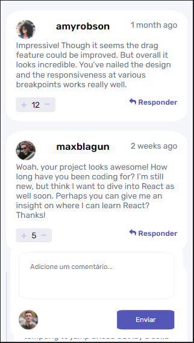
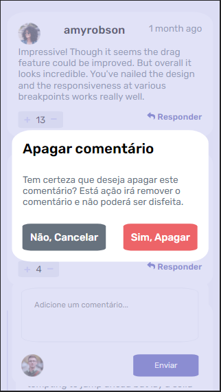
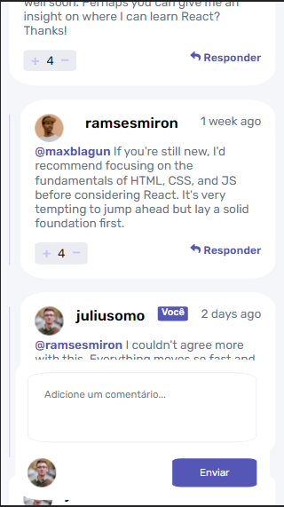

# Interactive Comments Section | Frontend Mentor

- [Features](#features)
- [Live Demo](#live-demo)
- [Screenshots](#screenshots)
- [How to Use](#how-to-use)
- [Contributing](#contributing)
- [License](#license)

A simple and interactive comments section built with HTML, CSS, and JavaScript.

## <a id="features">Features</a>

- Add comment
- Reply to comment
- Edit comment
- Delete comment
- Upvote/Downvote comment
- Indented replies with @username
- Personalized confirmation window for deleting a comment
- User recognition for displaying relevant buttons

## <a id="live-demo">Live Demo</a>

Try out the live version of the page clone [here](https://gentle-melomakarona-7e8c24.netlify.app/)

## <a id="screenshots">Sceenshots</a>

Here are some screenshots of the page clone in action: 

## <a id="how-to-use">How to Use</a>

1. Clone or download the repository
2. Open the index.html file in your preferred browser
3. Explore the different features and experiment with the code to improve your front-end skills

## <a id="contributing">Contributing</a>

Feel free to submit pull requests or issues if you have suggestions for improvements. This is a practice project and any feedback is welcome.

## <a id="license">License</a>

This project is licensed under MIT License.

